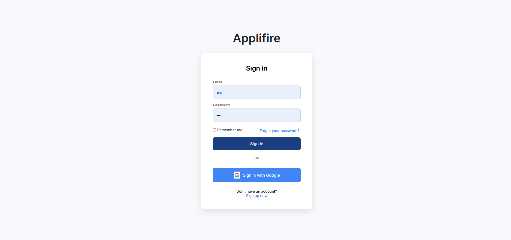
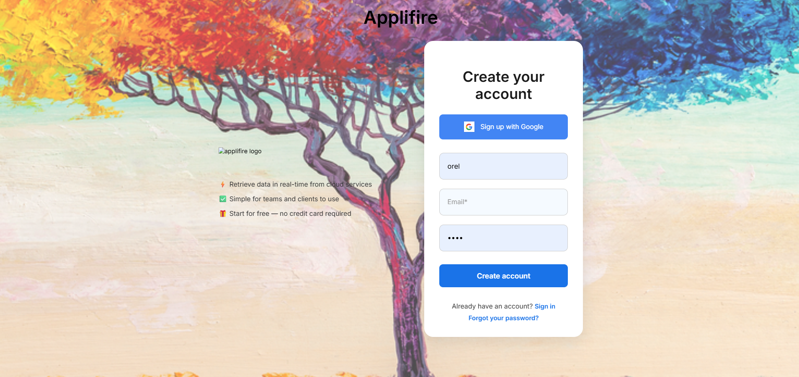
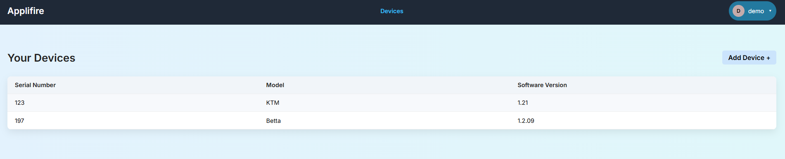

# Applifire – Full-Stack Web Application

Applifire is a full-stack web application built with **Python** and **Django**, featuring REST APIs, user authentication, account management, and a web-based user interface.

The project demonstrates backend development, API design, authentication flows, database integration, and full-stack application development.

## Features

- User registration and login
- Email verification during registration
- JWT-based authentication with access and refresh tokens
- Google authentication using Django Allauth
- Password reset via email and secure reset tokens
- Protected authenticated endpoints
- User profile functionality
- REST API endpoints built with Django REST Framework
- Web frontend using HTML, CSS, and JavaScript

## Tech Stack

### Backend
- Python
- Django
- Django REST Framework
- Simple JWT
- Django Allauth

### Database
- PostgreSQL

### Frontend
- HTML
- CSS
- JavaScript

### Tools & Environment
- Git / GitHub
- Postman
- Linux

## Authentication Flow

The application supports multiple authentication and account-management flows:

1. A user registers with a username, email, and password.
2. A verification email is sent before the account is activated.
3. After verification, users can log in and receive JWT access and refresh tokens.
4. Authenticated endpoints are protected using Django REST Framework permissions.
5. Users can also authenticate through Google using Django Allauth.
6. Password recovery is supported through email-based reset links and secure Django tokens.

## REST API

The backend exposes REST endpoints for authentication and application functionality. The APIs use Django REST Framework and JWT authentication for protected resources.

The project was also tested during development using tools such as Postman and cURL.

## Screenshots

### Sign in



### Sign up



### Devices dashboard



## Running the Project Locally

### 1. Clone the repository

```bash
git clone https://github.com/TwitOrel/applifire-Project.git
cd applifire-Project
```

### 2. Create and activate a virtual environment

```bash
python -m venv venv
```

Windows:

```bash
venv\Scripts\activate
```

Linux/macOS:

```bash
source venv/bin/activate
```

### 3. Install dependencies

```bash
pip install -r requirements.txt
```

### 4. Configure environment variables

Create the required environment configuration for the database, email service, Django secret key, and Google authentication credentials before running the application.

### 5. Run database migrations

```bash
python manage.py migrate
```

### 6. Start the development server

```bash
python manage.py runserver
```

## What I Practiced

This project gave me hands-on experience with:

- Building backend functionality with Django and Python
- Designing REST APIs
- Implementing authentication and authorization flows
- Working with JWT tokens
- Integrating third-party authentication
- Working with PostgreSQL
- Connecting frontend functionality to backend APIs
- Debugging and testing web application flows

## Author

**Orel Twito**  
B.Sc. in Computer Science | Software Developer
